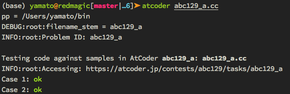
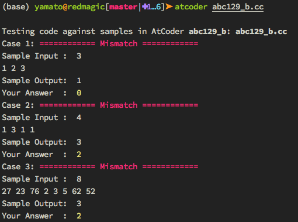

# AtCoder Sample Cases Tester

Run your answer to AtCoder problems with sample cases **without copy-pasting**! This script scrapes sample inputs/outputs, and then run your code with the sample cases.


## Requirement

- Python 3.x
- [Beautiful Soup 4](<http://www.crummy.com/software/BeautifulSoup/>)
- [keyring](https://github.com/jaraco/keyring)


## Setup

```bash
# [Optional] Activate conda environment
conda activate env

# Install beautifulsoup4 with conda or pip
conda install beautifulsoup4

# Clone this repository
git clone https://github.com/yamaton/atcoder-scrape-and-local-test.git

# Create a symbolic link to ~/bin
ln -s  $(readlink -f ./atcoder-scrape-and-local-test/src/run_with_atcoder_sample.py) ~/bin/atcoder

# Set path to ~/bin (choose one from following)

# bash (skip otherwise)
echo "export PATH=$HOME/bin:$PATH" >> ~/.bash_profile
source ~/.bash_profile

# zsh (skip otherwise)
echo "export PATH=$HOME/bin:$PATH" >> ~/.zshenv        # for zsh
source ~/.zshenv

# fish (skip otherwise)
echo "set -gx PATH \$PATH $HOME/bin" >> ~/.config/fish/config.fish

# Securely save username and password locally
python ./atcoder-scrape-and-local-test/src/set_login_info.py
```


## Usage

```bash
atcoder path/to/solution/like/abc130/a.cpp
```


**NOTE:** the filename or file path **must** contain a problem ID. You may have another
string in the filename as long as they are separated by space , or hyphen
`-`, or underscore `_`. For example, following filenames are all allowed.

* abc130_a.cpp
* abc130/a.cpp
* abc130/a-Rounding.cpp


The script `run_with_atcoder_sample.py` feeds the samples cases to your code as standard input, and returns “ok” if the standard output agrees with the samples.




Otherwise, it returns “Incorrect”, and shows sample input, your output, and sample output. This happens as long as output strings do not agree **exactly**.




## Supported Language / Platform

The script identifies language by file extension. Here is what's supported currently.

* C++14 (GCC) (.cc / .cpp / .cxx / .c++)
* Python3 (.py)
* Rust (.rs)
* F# (.fs / .fsx)
* Haskell (.hs)
* Kotlin (.kt)
* Nim (.nim)


## Configuration

Compilation options follows the [official rules](https://atcoder.jp/contests/agc034/rules). For example in case of C++14 (GCC),

```bash
g++ -std=gnu++1y -o abc130_a.exe abc130_a.cc
abc130_a.exe < abc130_a_0.txt   # input file is auto generated
```


## [TODOs] Things to add later when I feel like to…

* Better setup
* Command-line options
  * Enable using extra libraries like boost
  * Choose another compiler / interpreters such as clang, pypy
* More languages
* Run remotely on "Custom Test" in AtCoder server
* Submission?
